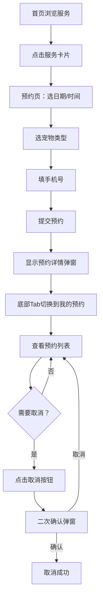

## 1. 产品概述
宠物美容店线上预约小站，为宠物主人提供便捷的美容服务预约渠道，支持浏览服务项目、在线预约以及管理个人预约记录。
- 主要目标用户：养猫/狗等宠物的主人
- 产品价值：减少线下排队等待，提升预约效率与用户体验

## 2. 核心功能

### 2.1 功能模块
1. **首页**：Banner轮播图、服务项目卡片展示
2. **预约页**：服务选择、日期时间段选择、宠物类型选择、手机号填写、预约确认弹窗
3. **我的预约页**：预约记录列表、取消预约功能（含二次确认）

### 2.2 页面详情
| 页面名称 | 模块名称 | 功能描述 |
|-----------|-------------|---------------------|
| 首页 | Banner区域 | 展示店铺宣传大图，营造温馨氛围 |
| 首页 | 服务卡片列表 | 展示洗澡、剪毛、SPA三种服务，每张卡片显示名称、价格、时长，点击跳转到预约页 |
| 预约页 | 日期选择器 | 选择预约日期（未来7天可选） |
| 预约页 | 时间段选择 | 选择具体时间段（上午/下午/晚上多个时段） |
| 预约页 | 宠物类型选择 | 单选：猫/狗/其他 |
| 预约页 | 手机号输入 | 主人联系电话，格式校验 |
| 预约页 | 确认弹窗 | 提交后弹出预约详情确认，含订单编号 |
| 我的预约页 | 预约列表 | 展示所有预约记录，包含服务名称、日期时间、宠物类型、状态 |
| 我的预约页 | 取消预约 | 每条记录右侧有取消按钮，点击弹出二次确认对话框 |

## 3. 核心流程

用户从首页浏览服务项目 → 点击感兴趣的服务卡片进入预约页 → 选择日期和时间段 → 选择宠物类型 → 填写手机号 → 提交预约 → 弹窗显示预约详情 → 用户可切换到"我的预约"查看所有预约 → 如需取消点击取消按钮并二次确认。

## 4. 用户界面设计

### 4.1 设计风格
- 主色调：暖橙色 #FF8C42
- 背景色：米白色 #FFF8F0
- 卡片样式：大圆角（16px）、柔和轻投影
- 按钮风格：圆角实心橙按钮，hover时颜色加深
- 字体：使用具有亲和力的无衬线字体
- 整体氛围：温暖、友好、专业的宠物服务感
- 图标风格：简洁可爱的线性图标，配合适当emoji点缀

### 4.2 页面设计概览
| 页面名称 | 模块名称 | UI要素 |
|-----------|-------------|-------------|
| 首页 | Banner区域 | 全宽大图，圆角底部，柔和渐变叠加 |
| 首页 | 服务卡片 | 卡片横向排列（移动端纵向），左图标右信息，底部价格标签 |
| 预约页 | 表单区域 | 分组布局，每个选择区域独立卡片包裹 |
| 预约页 | 确认弹窗 | 居中弹窗，半透明遮罩，详情列表展示 |
| 我的预约页 | 预约列表 | 纵向卡片列表，右侧取消按钮橙色边框 |
| 全局 | 底部Tab栏 | 固定底部，三Tab切换，选中态橙色高亮，含图标+文字 |

### 4.3 响应式设计
- 移动端优先适配（375px-430px宽度）
- 平板及桌面端居中容器展示，最大宽度限制480px模拟手机体验
- 触摸友好：按钮最小44px高度，足够点击区域
