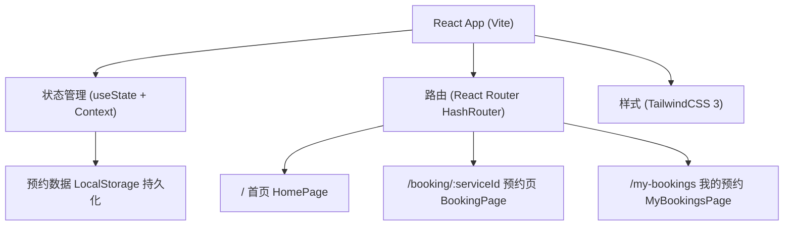

## 1. 架构设计



## 2. 技术说明
- 前端框架：React@18
- 构建工具：Vite@5
- 样式方案：TailwindCSS@3
- 路由管理：React Router@6 (HashRouter)
- 状态管理：React Context + useState
- 数据持久化：localStorage（模拟后端存储）
- 图标方案：emoji + 自定义SVG图标

## 3. 路由定义
| 路由 | 用途 |
|-------|---------|
| / | 首页：Banner + 服务卡片列表 |
| /booking/:serviceId | 预约页：填写预约信息，serviceId对应所选服务 |
| /my-bookings | 我的预约：预约记录列表与取消操作 |

## 4. 数据模型

### 4.1 服务项目 (Service)
```typescript
interface Service {
  id: string;
  name: string;
  description: string;
  price: number;
  duration: number; // 分钟
  icon: string; // emoji图标
}
```

### 4.2 预约记录 (Booking)
```typescript
interface Booking {
  id: string;
  serviceId: string;
  serviceName: string;
  date: string; // YYYY-MM-DD
  timeSlot: string; // HH:mm-HH:mm
  petType: 'cat' | 'dog' | 'other';
  phone: string;
  status: 'pending' | 'cancelled';
  createdAt: number;
}
```

### 4.3 初始数据
```javascript
// 服务项目初始数据
const SERVICES = [
  { id: 'bath', name: '宠物洗澡', description: '专业洗护，包含吹干梳毛', price: 88, duration: 60, icon: '🛁' },
  { id: 'grooming', name: '造型剪毛', description: '专业美容师修剪造型', price: 168, duration: 90, icon: '✂️' },
  { id: 'spa', name: '宠物SPA', description: '精油按摩+深层护理', price: 238, duration: 120, icon: '💆' }
];

// 可选时间段
const TIME_SLOTS = [
  '09:00-10:00', '10:30-11:30',
  '13:00-14:00', '14:30-15:30', '16:00-17:00',
  '18:00-19:00', '19:30-20:30'
];
```

## 5. 项目目录结构
```
project52/
├── src/
│   ├── components/
│   │   ├── BottomTabBar.jsx       # 底部Tab导航
│   │   ├── ServiceCard.jsx        # 服务卡片组件
│   │   ├── BookingModal.jsx       # 预约确认弹窗
│   │   └── ConfirmDialog.jsx      # 二次确认对话框
│   ├── context/
│   │   └── BookingContext.jsx     # 预约状态管理
│   ├── pages/
│   │   ├── HomePage.jsx           # 首页
│   │   ├── BookingPage.jsx        # 预约页
│   │   └── MyBookingsPage.jsx     # 我的预约页
│   ├── data/
│   │   └── services.js            # 服务项目数据
│   ├── App.jsx
│   ├── main.jsx
│   └── index.css
├── index.html
├── tailwind.config.js
├── vite.config.js
└── package.json
```
